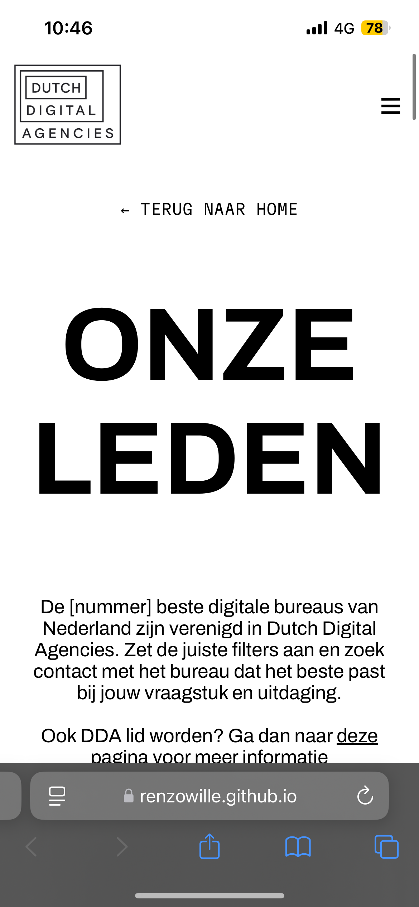

# The Client - Website

Ontwerp en maak een website voor een opdrachtgever en bespreek het resultaat tijdens de Sprint Review.

## Inhoudsopgave Readme

  * [Intro](#intro)
  * [Beschrijving](#beschrijving)
  * [Kenmerken](#kenmerken)
  * [Licentie](#licentie)

## Intro

Voor deze sprint kregen we de opdracht van de opdrachtgevers om het nieuwe ontwerp voor de website van DDA te bouwen. Hierbij begonnen we met het schrijven van de HTML, en daarna het schrijven van de CSS.

De vraag van de opdrachtgever was dus de website zo goed mogelijk te kunnen bouwen, waarbij we per persoon een pagina hebben gekozen om te gaan bouwen. Ik heb gekozen om de "Onze Leden" pagina te bouwen. 

De link naar de pagina: https://renzowille.github.io/the-client-website/ 

## Beschrijving

De pagina laat de "leden" zien van DDA. Je krijgt hier de kans om te kunnen filteren op deze leden. De filter zelf staat er al met HTML, alleen heb ik nog niet kunnen laten werken. 

De mobiele versie van de pagina, is responsive gemaakt:

De desktop versie van de pagina:

## Kenmerken

<strong>HTML</strong>

De HTML is via de code conventies geschreven van de HVA, om het zo duidelijk mogelijk te maken om te lezen. Ik heb zo veel mogelijk geprobeerd "div" elementen te vermijden en heb "article" elementen toegevoegd om deze een elementen naam te geven voor de browsers.

Voor de filter heb ik gebruik gemaakt van een checkbox en heb ik de verschillende li's in een label gezet.

Verder heb ik ervoor gezorgd dat de HTML genoeg ademruimte heeft en dat deze semantisch is opgesteld. 

<strong>CSS</strong>

Voor CSS heb ik gebruik gemaakt grid en flex elementen. 

Voor de navigatie heb ik ervoor gezorgd dat het menu op kleine schermen in een hamburger menu laat zien, en grote schermen het volledige scherm gebruiken. Hier heb ik de media queries voor gebruikt.

Voor de block-container heb ik een grid element gebruikt om deze goed te kunnen plaatsen naast elkaar en er columns van te maken.

Ook voor de footer sectie heb ik een grid gebruikt om deze goed te kunnen orderen voor desktop apparaten. Hier heb ik grid-template-columns: 2fr 1fr 1fr; gebruikt om te zorgen dat het eerste blokje breder is dan de andere twee.

<strong>Media Queries</strong>

Omdat ik geen mobile-first ontwerp heb aangehouden, heb ik gebruik gemaakt van "max-width" media queries om het ontwerp alsnog responsive te maken voor kleinere schermen.

## Licentie

This project is licensed under the terms of the [MIT license](./LICENSE).
